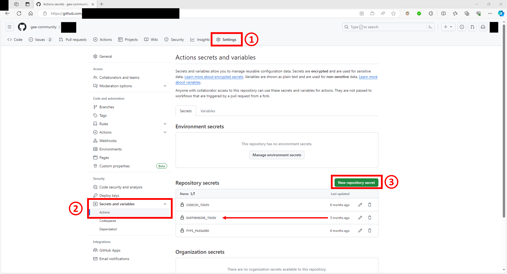

Installation
============

Getting started
---------------

Use pip/conda to install **pytest-gee** in your environment:

.. tab-set::

    .. tab-item:: pip

        .. code-block:: console

            pip install pytest-gee

    .. tab-item:: conda

        .. code-block:: console

            conda install -c conda-forge pytest-gee

It will then be automatically detected by ``pytest`` when you run your test suit.

Connect To Google Earth Engine
------------------------------

The main purpose of this plugin is to facilitate the connection to Google Earth Engine API in both CI/CD tests and local tests.
To do so, the lib will provide a number of connection methods that will hopefully cover your favorite way of connecting to GEE.

.. note::

    If you would like us to code an extra connection method please `open an issue <https://github.com/gee-community/pytest-gee/issues/new/choose>`__ on the github repo and never forget that contribution are very welcome!

.. note::

    All the methods presented in this section will fallback to a regular ``ee.Initialize()`` if the environment parameter are not found.
    This means that you can use this plugin in your local environment without having to change anything as long as the ``ee`` module is installed and that you already run once ``ee.Authenticate()``.

.. danger::

    Never forget that this method can potentially expose your personal credential to GEE so take some safety precautions before starting:

    - make sure the CI/CD platform support private variable (that are not exposed in the build logs)
    - make sure to review PR from new users before starting the build to make sure nobody steal your credentials
    - make sure the account you are using will have access to all the assets you need to run your tests
    - create small tests that will run quickly to make sure you don't overload your own GEE account with concurrent tasks

Private Token
^^^^^^^^^^^^^

The first method is to use a private token. This is the easiest way to connect to GEE in a CI/CD environment.

First authenticate to GEE API in your local computer using ``ee.Authenticate()``.

Then copy the ``credentials`` file content. This file is located in a different folder depending on the platform you use:

- Windows: ``C:\Users\USERNAME\\.config\\earthengine\\credentials``
- Linux: ``/home/USERNAME/.config/earthengine/credentials``
- MacOS: ``/Users/USERNAME/.config/earthengine/credentials``

Paste this content in your CI/CD environment in a ``EARTHENGINE_TOKEN`` variable.

Here is a github action example:

#. First go to the :guilabel:`settings`` of your Github repository
#. Then to :guilabel:`secretes and variables` -> :guilabel:`Actions`
#. In this page, set a :guilabel:`new repository secret` with the name ``EARTHENGINE_TOKEN`` and paste the content of your ``credentials`` file in the value field.

Since earthengine-api v0.1.370, it's not possible to use EE without providing a GCS project bucket. Save this value in a `EARTHENGINE_PROJECT` variable, it will be used in the method.

To make the variable available in your CI environment, you will need to add the following line in your action `.yaml` file:

.. code-block:: yaml

    # .github/action.yaml

    env:
        EARTHENGINE_TOKEN: ${{ secrets.EARTHENGINE_TOKEN }}
        EARTHENGINE_PROJECT: ${{ secrets.EARTHENGINE_PROJECT }}

    # The rest of your tests configuration

When working in your local environment export a ``EARTHENGINE_PROJECT`` variable as well:

.. code-block:: console

    export EARTHENGINE_PROJECT=ee-community

Finally you need to configure the ``pytest`` execution environment itself. Add the following line in your ``conftest.py`` file:

.. code-block:: python

    # conftest.py

    import pytest_gee

    def pytest_configure():
        pytest_gee.init_ee_from_token()

You are now ready to make API calls within your tests!

Service account
^^^^^^^^^^^^^^^

.. warning::

    This documentation assumes that you already have a Google cloud service account and that you have generated an API key for it. If not, please refer to Google own `documentation <https://cloud.google.com/iam/docs/keys-create-delete>`__ to proceed.

Paste this content of the `private-key.json` in your CI/CD environment in a ``EARTHENGINE_SERVICE_ACCOUNT`` variable.

Here is a github action example:

#. First go to the :guilabel:`settings` of your Github repository
#. Then to :guilabel:`secretes and variables` -> :guilabel:`Actions`
#. In this page, set a :guilabel:`new repository secret` with the name ``EARTHENGINE_SERVICE_ACCOUNT`` and paste the content of your ``credentials`` file in the value field.

Currently when the earthengine-api is Initialized using a service account, the name of the associated cloud project is not detectable. It will prevent the initialization of the test folder generated from `pytest-gee`. To avoid this issue the method rely also on a ``EARTHENGINE_PROJECT`` env variable where you can set the name of your project.

To make the variable available in your CI environment, you will need to add the following line in your action `.yaml` file:

.. code-block:: yaml

    # .github/action.yaml

    env:
        EARTHENGINE_SERVICE_ACCOUNT: ${{ secrets.EARTHENGINE_SERVICE_ACCOUNT }}
        EARTHENGINE_PROJECT: ${{ secrets.EARTHENGINE_PROJECT }}

    # The rest of your tests configuration

When working in your local environment export a ``EARTHENGINE_PROJECT`` variable as well:

.. code-block:: console

    export EARTHENGINE_PROJECT=ee-community

Finally you need to configure the ``pytest`` execution environment itself. Add the following line in your ``conftest.py`` file:

.. code-block:: python

    # conftest.py

    import pytest_gee

    def pytest_configure():
        pytest_gee.init_ee_from_service_account()

You are now ready to make API calls within your tests!
