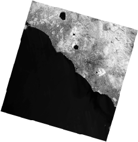
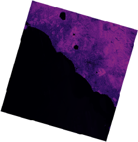

Regression fixtures
===================

**pytest-gee** fixtures that will make it easy to generate test data for your test suits using Earth
Engine server side objects as sources. It is based on the ``pytest-regressions`` plugin and add GEE
data management backend. We highly recommend users to read their `documentation <https://pytest-regressions.readthedocs.io/en/latest/overview.html>`__
to understand how to use some parameter of the fixtures like the saving directory and the management
of parametrized tests.

.. note::

    The fixtures provided by this plugin are based on the ``pytest-regressions`` plugin and are fully
    compatible with it. This means that you can use the ``pytest-regressions`` fixtures and the ``pytest-gee``
    fixtures in the same test suit.

ee_list_regression
------------------

Suppose the output of our test is a :py:class:`ee.List` object containing informmation. We could
test the result as follow:

.. code-block:: python

    def test_list():
        list = ee.List([ee.Number(0.11111111), ee.String("test")])
        assert list.getInfo()[0] == 0.11111111
        assert list.getInfo()[1] == "test"

But this presents a number of problems:

-   Gets old quickly.
-   Error-prone.
-   If a check fails, we don’t know what else might be wrong with the obtained data.
-   Does not scale for large data.

Instead, we can use the :py:func:`ee_list_regression <pytest_gee.plugin.ee_list_regression>` fixture to save
the expected output and compare it with the obtained output in a humanly readable format:

.. code-block:: python

    def test_list(ee_list_regression):
        list = ee.List([ee.Number(0.11111111), ee.String("test")])
        ee_list_regression.check(list)

That will be saved in a yaml file:

.. code-block:: yaml

    # <path_to_test_folder>/<filename>/<test name>.yaml
    - 0.11111111
    - test

ee_dictionary_regression
------------------------

Suppose the output of our test is a :py:class:`ee.Dictionary` object containing informmation. We could
test the result as follow:

.. code-block:: python

    def test_dict():
        dict = ee.Dictionary({"key1": ee.Number(0.11111111), "key2": ee.String("test")})
        assert dict.getInfo()["key1"] == 0.11111111
        assert dict.getInfo()["key2"] == "test"

But this presents a number of problems:

-   Gets old quickly.
-   Error-prone.
-   If a check fails, we don’t know what else might be wrong with the obtained data.
-   Does not scale for large data.

Instead, we can use the :py:func:`ee_dictionary_regression <pytest_gee.plugin.ee_dictionary_regression>` fixture
to save the expected output and compare it with the obtained output in a humanly readable format:

.. code-block:: python

    def test_dict(ee_dictionary_regression):
        dict = ee.Dictionary({"key1": ee.Number(0.11111111), "key2": ee.String("test")})
        ee_dictionary_regression.check(dict)

That will be saved in a yaml file:

.. code-block:: yaml

    # <path_to_test_folder>/<filename>/<test name>.yaml
    key1: 0.11111111
    key2: test

ee_feature_collection_regression
--------------------------------

Suppose the output of our test is a :py:class:`ee.FeatureCollection` object containing informmation.
We could test the result as follow:

.. code-block:: python

    def test_fc():
        fc = ee.FeatureCollection([ee.Feature(ee.Geometry.Point([0, 0]), {"key1": 0.11111111, "key2": "test"})])
        assert fc.getInfo()["features"][0]["properties"]["key1"] == 0.11111111
        assert fc.getInfo()["features"][0]["properties"]["key2"] == "test"
        assert fc.getInfo()["features"][0]["geometry"]["type"] == "Point"

Instead we can use the :py:func:`ee_feature_collection_regression <pytest_gee.plugin.ee_feature_collection_regression>`
fixture to save the expected output and compare it with the obtained output in a humanly readable format
compatible with the ``geo_interface`` standard:

.. code-block:: python

    def test_fc(ee_feature_collection_regression):
        fc = ee.FeatureCollection([ee.Feature(ee.Geometry.Point([0, 0]), {"key1": 0.11111111, "key2": "test"})])
        ee_feature_collection_regression.check(fc)

That will be saved in a yaml file:

.. code-block:: yaml

    # <path_to_test_folder>/<filename>/<test name>.yaml
    type: FeatureCollection
    features:
    - type: Feature
      geometry:
        type: Point
        coordinates:
        - 0
        - 0
      properties:
        key1: 0.11111111
        key2: test

ee_image_regression
-------------------

Suppose the output of our test is a :py:class:`ee.Image` object containing informmation. We could test the result as follow:

.. code-block:: python

    import ee
    import pytest

    def test_image():
        image = ee.Image("LANDSAT/LC08/C02/T1_L2/LC08_191031_20240607")
        image = image.normalizedDifference(["SR_B5", "SR_B4"])
        assert image.bandNames().size().getInfo() == 1

Instead we can use the :py:func:`ee_image_regression <pytest_gee.plugin.ee_image_regression>` fixture to save the expected output and compare
it with the obtained output as a processed `.png` image:

.. code-block:: python

    import ee
    import pytest

    def test_image(ee_image_regression):
        image = ee.Image("LANDSAT/LC08/C02/T1_L2/LC08_191031_20240607")
        image = image.normalizedDifference(["SR_B5", "SR_B4"])
        ee_image_regression.check(image, scale=1000)

That will be saved in a png file:

:py:func:`ee_image_regression <pytest_gee.plugin/ee_image_regression>` comes with more extra options than the other regressions as you need to give information
about the scale, region and bands you want to see on the final output. First the image must be **small** as the
image is generated via the :py:meth:`ee.Image.getThumbURL` method hat has a maximum limit of pixels.
By default the fixture will autodetect the number of bands and display either a black&white single band or a
RGB representation of the 3 first bands. You can customize the output by passing the ``viz_params`` argument to the
:py:func:`check() <pytest_gee.image_regression.ImageFixture.check>` method. The ``viz_params`` argument is a dictionary that
is the same as the one used in the :py:meth:`ee.Image.getThumbURL` method. For example to display the image in
magma colormap with the value stretched to 2 standard deviation (instead of the default min-max) you can do:

.. code-block:: python

    import ee
    import pytest

    def test_image(ee_image_regression):
        image = ee.Image("LANDSAT/LC08/C02/T1_L2/LC08_191031_20240607")
        image = image.normalizedDifference(["SR_B5", "SR_B4"])
        palette = ["#000004", "#2C105C", "#711F81", "#B63679", "#EE605E", "#FDAE78", "#FCFDBF"]
        viz = {"bands": ["nd"], "min": 0.0122, "max": 1.237, "palette": palette}
        ee_image_regression.check(image, viz_params=viz, scale=1000)

